# Day 84: Introduction to GitOps and ArgoCD

## Goal

Today I moved the AI-BankApp deployment from manual `kubectl apply` to a GitOps workflow using ArgoCD on EKS. The main idea is that Git becomes the source of truth and ArgoCD continuously reconciles the Kubernetes cluster with the manifests committed in Git.

Repository used for the deployment:

```text
https://github.com/Devel955/AI-BankApp-DevOps.git
Branch: feat/gitops
Path watched by ArgoCD: k8s
```

## Task 1: Understand GitOps

GitOps is a deployment methodology where the desired state of infrastructure and applications is stored declaratively in Git. Instead of a person running `kubectl apply` from a laptop, an operator such as ArgoCD watches the Git repository and applies the committed state to the cluster.

In this model:

- Git is the single source of truth.
- Kubernetes YAML describes the desired state.
- ArgoCD compares the Git state with the live cluster state.
- If Git changes, ArgoCD syncs the cluster.
- If someone changes the cluster manually, ArgoCD detects drift and can repair it.
- Every change gets Git history, review, rollback, and audit trail.

### OpenGitOps Principles

| Principle | Meaning |
| --- | --- |
| Declarative | The desired state is written as Kubernetes manifests. |
| Versioned and immutable | The desired state is stored in Git and tracked through commits. |
| Pulled automatically | ArgoCD pulls changes from Git instead of CI pushing to the cluster. |
| Continuously reconciled | ArgoCD continuously compares Git with the live cluster and fixes drift. |

### GitOps vs Traditional CI/CD

| Aspect | Traditional CI/CD | GitOps |
| --- | --- | --- |
| Deployment trigger | CI pipeline runs `kubectl apply` | Git commit triggers ArgoCD sync |
| Source of truth | Pipeline scripts and applied YAML | Git repository |
| Drift detection | Usually none | Continuous reconciliation |
| Rollback | Re-run pipeline or apply old YAML | `git revert` |
| Audit trail | Pipeline logs | Git commit history and ArgoCD sync history |
| Access control | CI server needs cluster credentials | ArgoCD has cluster access |
| Security | CI often has broad cluster access | Developers push to Git, not directly to the cluster |

## AI-BankApp GitOps Flow

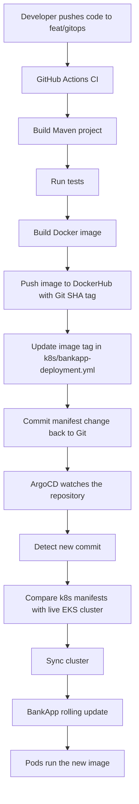

After the developer pushes to Git, the CI pipeline builds and updates the image tag. ArgoCD detects the Git change and reconciles the Kubernetes cluster without a human running `kubectl apply`.

## Task 2: Access ArgoCD on EKS

I verified that ArgoCD was running in the `argocd` namespace:

```bash
kubectl get pods -n argocd
```

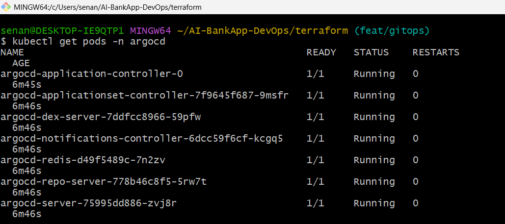

The ArgoCD UI was accessible through local port forwarding. Before creating the `bankapp` Application, the UI showed no managed applications.

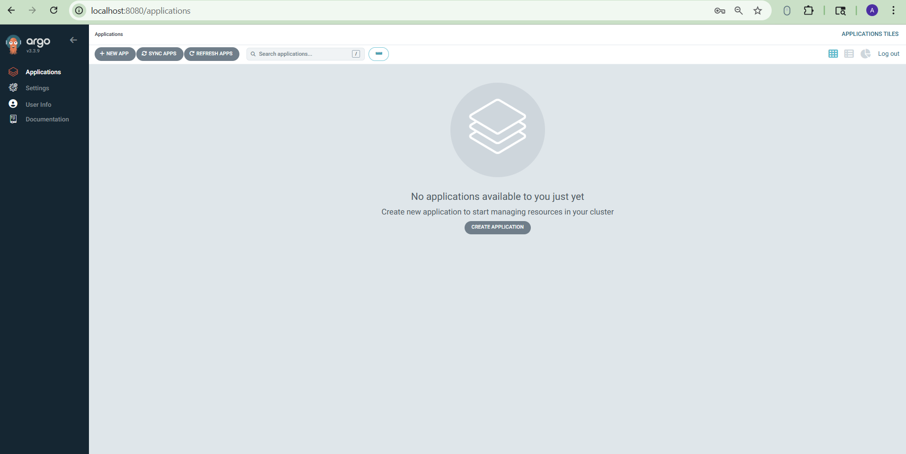

I also verified the ArgoCD CLI installation:

```bash
argocd version --client
```

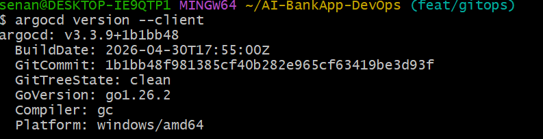

## Task 3: Study the Application Manifest

The ArgoCD Application manifest used for BankApp:

```yaml
apiVersion: argoproj.io/v1alpha1
kind: Application
metadata:
  name: bankapp
  namespace: argocd
spec:
  project: default
  source:
    repoURL: https://github.com/Devel955/AI-BankApp-DevOps.git
    targetRevision: feat/gitops
    path: k8s
  destination:
    server: https://kubernetes.default.svc
    namespace: bankapp
  syncPolicy:
    automated:
      prune: true
      selfHeal: true
    syncOptions:
      - CreateNamespace=true
      - ServerSideApply=true
```

| Field | Value | Purpose |
| --- | --- | --- |
| `apiVersion` | `argoproj.io/v1alpha1` | Uses the ArgoCD Application CRD. |
| `kind` | `Application` | Defines an ArgoCD managed application. |
| `metadata.name` | `bankapp` | Name shown in ArgoCD. |
| `metadata.namespace` | `argocd` | The Application object lives in the ArgoCD namespace. |
| `spec.project` | `default` | Uses the default ArgoCD project. |
| `source.repoURL` | `Devel955/AI-BankApp-DevOps` | Git repository watched by ArgoCD. |
| `source.targetRevision` | `feat/gitops` | Branch watched by ArgoCD. |
| `source.path` | `k8s` | Directory containing Kubernetes manifests. |
| `destination.server` | `https://kubernetes.default.svc` | Deploys to the in-cluster Kubernetes API. |
| `destination.namespace` | `bankapp` | Target namespace for app resources. |
| `syncPolicy.automated` | enabled | Allows automatic sync from Git to cluster. |
| `prune` | `true` | Deletes live resources removed from Git. |
| `selfHeal` | `true` | Reverts manual changes made directly in the cluster. |
| `CreateNamespace=true` | enabled | Creates the `bankapp` namespace automatically. |
| `ServerSideApply=true` | enabled | Uses Kubernetes server-side apply for field ownership handling. |

## Task 4: Deploy AI-BankApp Through ArgoCD

I created the ArgoCD Application for the BankApp fork:

```bash
kubectl apply -f argocd/application.yml
```

Then I watched the sync through CLI:

```bash
argocd app get bankapp
argocd app sync bankapp
```

During the first sync I hit two real issues:

1. `BackendTrafficPolicy` failed because the installed Envoy Gateway CRD expected `targetRef`, while the manifest used `targetRefs`.
2. Gateway and HTTPRoute were degraded because the HTTPS listener expected a TLS secret. For this task, I switched the Gateway to HTTP-only so the GitOps deployment could become fully healthy.

The final sync succeeded:

```text
Sync Status: Synced to feat/gitops (a6f4c45)
Health Status: Healthy
Phase: Succeeded
Message: successfully synced (all tasks run)
```

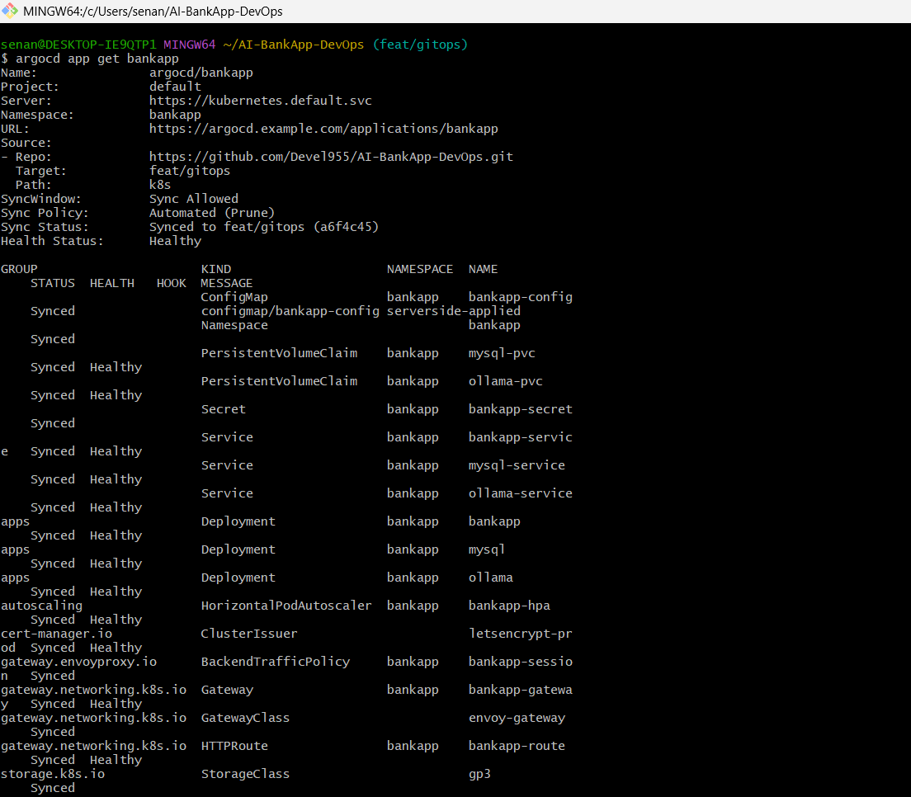

## Task 5: Explore ArgoCD Live View

After the final sync, the ArgoCD UI showed the `bankapp` application as Healthy and Synced.

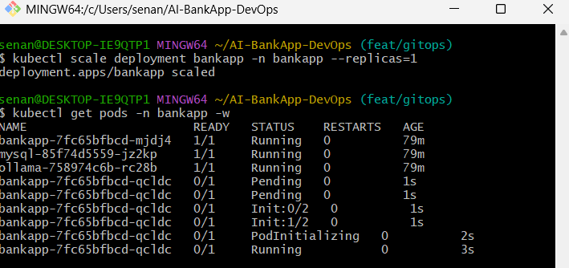

The resource tree showed ArgoCD managing the BankApp resources from Git:

- Namespace
- ConfigMap
- Secret
- PVCs
- Services
- MySQL Deployment
- Ollama Deployment
- BankApp Deployment
- HPA
- Gateway
- HTTPRoute
- BackendTrafficPolicy
- GatewayClass
- StorageClass
- ClusterIssuer

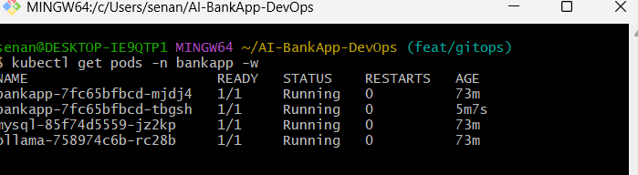

I also checked sync history:

```bash
argocd app history bankapp
```

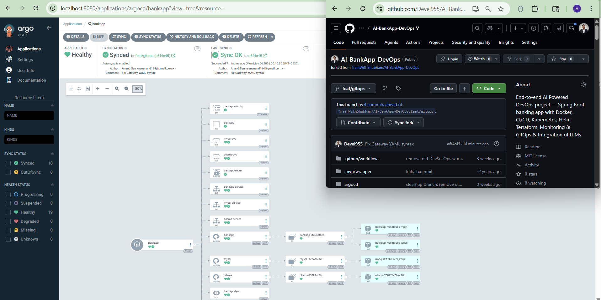

## Task 6: Test Self-Healing

### Test 1: Manual Scale

I manually scaled the BankApp deployment:

```bash
kubectl scale deployment bankapp -n bankapp --replicas=1
```

Then I watched the pods:

```bash
kubectl get pods -n bankapp -w
```

The cluster briefly changed, then the BankApp returned to the HPA-managed desired state. The HPA had a minimum of 2 replicas, so the final state returned to 2 BankApp pods.

```text
bankapp-hpa   Deployment/bankapp   cpu: 0%/70%   MINPODS=2   MAXPODS=4   REPLICAS=2
bankapp       READY 2/2
```

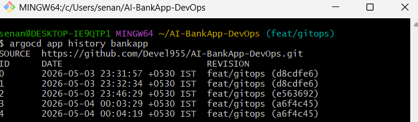

### Test 2: Delete ConfigMap

I manually deleted the `bankapp-config` ConfigMap:

```bash
kubectl delete configmap bankapp-config -n bankapp
```

ArgoCD recreated it from Git. After reconciliation:

```bash
kubectl get configmap bankapp-config -n bankapp
```

```text
NAME             DATA   AGE
bankapp-config   5      50s
```

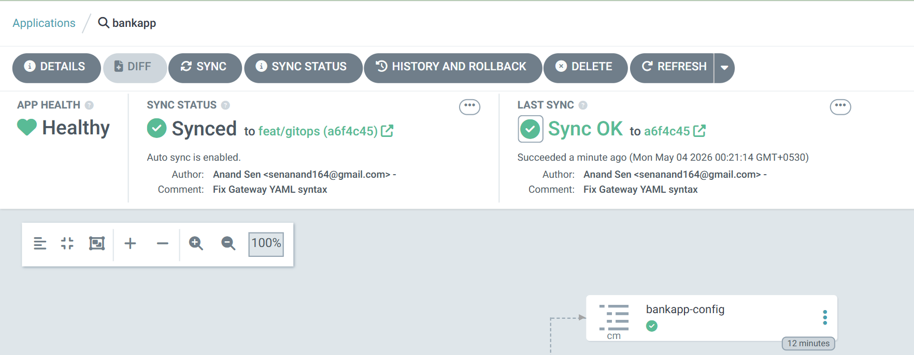

The ArgoCD resource detail view showed the ConfigMap as Synced again:

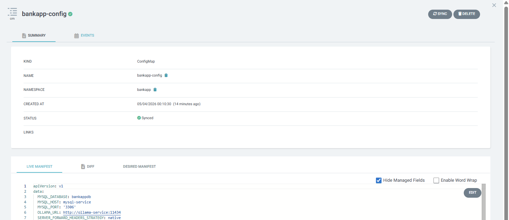

## What Prune, Self-Heal, and ServerSideApply Do

| Option | Meaning | Why it matters |
| --- | --- | --- |
| `prune: true` | Deletes live cluster resources that were removed from Git. | Prevents old resources from staying in the cluster after they are no longer desired. |
| `selfHeal: true` | Reverts manual live-cluster changes back to the Git state. | Protects the cluster from configuration drift. |
| `ServerSideApply=true` | Uses Kubernetes server-side apply. | Improves field ownership handling and avoids large client-side apply annotations. |

## Final Status

```text
Application: bankapp
Repository: https://github.com/Devel955/AI-BankApp-DevOps.git
Branch: feat/gitops
Path: k8s
Namespace: bankapp
Sync Status: Synced
Health Status: Healthy
Revision: a6f4c45
```

## Key Learnings

GitOps makes Kubernetes deployments more reliable because the desired state is always in Git. ArgoCD gives visibility into what is deployed, which commit was synced, and whether the cluster still matches the repository. Manual cluster edits do not survive when self-healing is enabled, so real changes must go through Git.

## LinkedIn Post

Started the GitOps block today -- deployed the AI-BankApp through ArgoCD on EKS instead of `kubectl apply`.

ArgoCD watches the Git repo and syncs changes automatically. Tested self-healing by manually scaling pods and deleting ConfigMaps -- ArgoCD reverted every change within minutes.

The cluster now always matches Git. No more "who ran kubectl on Friday night?"

`#90DaysOfDevOps` `#DevOpsKaJosh` `#TrainWithShubham`
