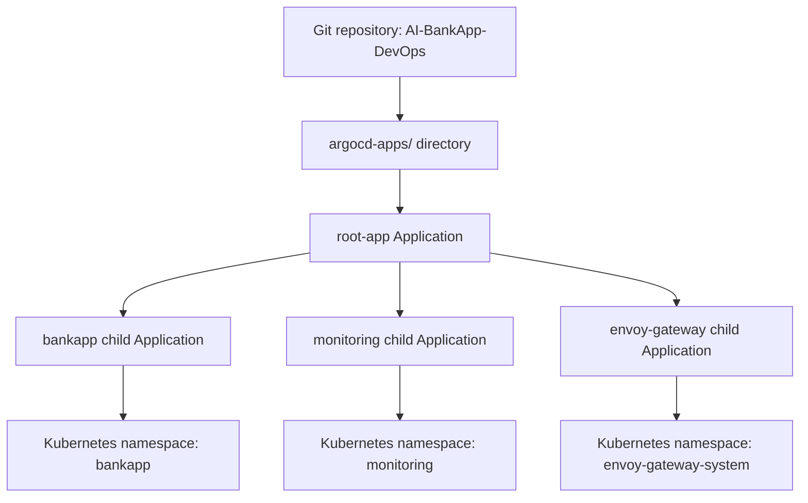

# Day 85: ArgoCD Deep Dive

## Goal

Today I went deeper into ArgoCD operational patterns used in production GitOps environments: manual and automated sync strategies, sync waves, rollbacks, App of Apps, notifications, Projects, and RBAC.

Repository used:

```text
https://github.com/Devel955/AI-BankApp-DevOps.git
Branch: feat/gitops
Application: bankapp
Namespace: bankapp
```

The main learning is that GitOps is more than "deploy from Git". ArgoCD gives teams a controlled workflow for ordering resources, reviewing drift before sync, safely reverting bad releases, managing many applications, and limiting access between teams.

## Task 1: Sync Strategies

ArgoCD supports both automated and manual sync. The right choice depends on the environment and how much human review is required before cluster changes are applied.

| Strategy | Configuration | Behavior | Best for |
| --- | --- | --- | --- |
| Automated sync | `syncPolicy.automated` | ArgoCD applies Git changes automatically. | Dev, test, staging, fast-moving internal apps |
| Automated with prune | `prune: true` | Deletes live resources removed from Git. | Environments where Git must fully own the app lifecycle |
| Automated with self-heal | `selfHeal: true` | Reverts manual live-cluster drift back to Git. | Environments where manual changes should not survive |
| Manual sync | No `automated` section | ArgoCD detects drift but waits for a human sync. | Production or regulated environments |

Automated sync example:

```yaml
syncPolicy:
  automated:
    prune: true
    selfHeal: true
```

Manual sync example:

```yaml
syncPolicy: {}
```

I switched `bankapp` to manual sync:

```bash
argocd app set bankapp --sync-policy none
```

Then I changed the Git repository by editing `k8s/configmap.yml`, committed, and pushed the change. ArgoCD detected the new Git revision, but it did not apply it automatically.

Commands used to inspect and preview the change:

```bash
argocd app get bankapp
argocd app diff bankapp
argocd app sync bankapp --dry-run
```

The expected status in manual mode:

```text
Sync Status: OutOfSync
Health Status: Healthy
Automated sync: disabled
```

The dry run is useful because it shows exactly what ArgoCD would apply before touching the cluster. In the UI, clicking `Sync` opens a preview dialog that lists every resource that will be changed.

After reviewing the diff, I synced for real:

```bash
argocd app sync bankapp
```

Then I switched the app back to automated sync:

```bash
argocd app set bankapp --sync-policy automated --self-heal --auto-prune
```

## Task 2: Sync Waves and Resource Ordering

Sync waves control the order in which ArgoCD applies resources. Waves use integer annotations. Lower numbers run first, then zero, then positive numbers.

Resources in the same wave can sync in parallel. ArgoCD waits for each wave to become healthy before continuing to the next wave.

For AI-BankApp, the dependency order is important:

| Wave | Resources | Reason |
| --- | --- | --- |
| `-2` | Namespace, StorageClass | Base infrastructure must exist first. |
| `-1` | PVCs, ConfigMap, Secret | Storage and configuration are needed before pods start. |
| `0` | MySQL, Ollama, Services | Database, model service, and networking come before the app. |
| `1` | BankApp Deployment | Application starts after dependencies exist. |
| `2` | HPA | Scaling policy attaches after the Deployment exists. |

### Namespace

```yaml
apiVersion: v1
kind: Namespace
metadata:
  name: bankapp
  annotations:
    argocd.argoproj.io/sync-wave: "-2"
```

### StorageClass

```yaml
metadata:
  name: gp3
  annotations:
    argocd.argoproj.io/sync-wave: "-2"
```

### PVCs, ConfigMap, and Secret

```yaml
metadata:
  annotations:
    argocd.argoproj.io/sync-wave: "-1"
```

### MySQL, Ollama, and Services

```yaml
metadata:
  annotations:
    argocd.argoproj.io/sync-wave: "0"
```

### BankApp Deployment

```yaml
metadata:
  annotations:
    argocd.argoproj.io/sync-wave: "1"
```

### HPA

```yaml
metadata:
  annotations:
    argocd.argoproj.io/sync-wave: "2"
```

The final deployment order:

```text
Wave -2: Namespace, StorageClass
Wave -1: PVCs, ConfigMap, Secret
Wave  0: MySQL, Ollama, Services
Wave  1: BankApp Deployment
Wave  2: HPA
```

After committing and pushing the annotations, ArgoCD re-synced the application in wave order.

Screenshot to capture:

```markdown

```

## Task 3: ArgoCD Rollbacks

ArgoCD tracks sync history for each Application. I checked the history:

```bash
argocd app history bankapp
```

Example output:

```text
ID  DATE                 REVISION
1   2026-05-04 22:10:00  a6f4c45
2   2026-05-05 00:20:00  def5678
```

To rollback using ArgoCD:

```bash
argocd app rollback bankapp 1
argocd app get bankapp
```

An ArgoCD rollback changes the live cluster to match an older revision from sync history. It does not change Git. Because Git still points to the latest commit, the app can show `OutOfSync` after rollback.

The GitOps-correct rollback is a Git revert:

```bash
git revert HEAD
git push
```

| Method | Changes cluster? | Changes Git? | Audit trail | GitOps-correct? |
| --- | --- | --- | --- | --- |
| `argocd app rollback` | Yes | No | ArgoCD history only | Temporary fix |
| `git revert` | Yes, after ArgoCD syncs | Yes | Full Git history | Yes |

The proper production pattern is to use ArgoCD rollback only as an emergency cluster fix, then follow it with a Git revert so the desired state in Git matches the cluster again.

## Task 4: App of Apps Pattern

The App of Apps pattern uses one parent ArgoCD Application to manage multiple child Applications. This is useful when a platform team manages many services and wants a single Git directory to define what belongs in the cluster.

Architecture:



Directory created in the GitOps repository:

```text
argocd-apps/
  bankapp.yaml
  monitoring.yaml
  envoy-gateway.yaml
  root-app.yaml
```

### bankapp.yaml

```yaml
apiVersion: argoproj.io/v1alpha1
kind: Application
metadata:
  name: bankapp
  namespace: argocd
  finalizers:
    - resources-finalizer.argocd.argoproj.io
spec:
  project: default
  source:
    repoURL: https://github.com/Devel955/AI-BankApp-DevOps.git
    targetRevision: feat/gitops
    path: k8s
  destination:
    server: https://kubernetes.default.svc
    namespace: bankapp
  syncPolicy:
    automated:
      prune: true
      selfHeal: true
    syncOptions:
      - CreateNamespace=true
      - ServerSideApply=true
```

### monitoring.yaml

```yaml
apiVersion: argoproj.io/v1alpha1
kind: Application
metadata:
  name: monitoring
  namespace: argocd
  finalizers:
    - resources-finalizer.argocd.argoproj.io
spec:
  project: default
  source:
    repoURL: https://prometheus-community.github.io/helm-charts
    chart: kube-prometheus-stack
    targetRevision: "65.*"
    helm:
      values: |
        grafana:
          adminPassword: admin123
        prometheus:
          prometheusSpec:
            retention: 3d
            resources:
              requests:
                memory: 256Mi
                cpu: 100m
  destination:
    server: https://kubernetes.default.svc
    namespace: monitoring
  syncPolicy:
    automated:
      prune: true
      selfHeal: true
    syncOptions:
      - CreateNamespace=true
      - ServerSideApply=true
```

### envoy-gateway.yaml

```yaml
apiVersion: argoproj.io/v1alpha1
kind: Application
metadata:
  name: envoy-gateway
  namespace: argocd
  finalizers:
    - resources-finalizer.argocd.argoproj.io
spec:
  project: default
  source:
    repoURL: docker.io/envoyproxy
    chart: gateway-helm
    targetRevision: "v1.4.*"
  destination:
    server: https://kubernetes.default.svc
    namespace: envoy-gateway-system
  syncPolicy:
    automated:
      prune: true
      selfHeal: true
    syncOptions:
      - CreateNamespace=true
```

### root-app.yaml

```yaml
apiVersion: argoproj.io/v1alpha1
kind: Application
metadata:
  name: root-app
  namespace: argocd
spec:
  project: default
  source:
    repoURL: https://github.com/Devel955/AI-BankApp-DevOps.git
    targetRevision: feat/gitops
    path: argocd-apps
  destination:
    server: https://kubernetes.default.svc
    namespace: argocd
  syncPolicy:
    automated:
      prune: true
      selfHeal: true
```

After pushing the `argocd-apps/` directory, I applied the parent app:

```bash
kubectl apply -f argocd-apps/root-app.yaml
argocd app list
```

Expected result:

```text
root-app
bankapp
monitoring
envoy-gateway
```

Screenshot to capture:

```markdown

```

The benefit is that adding a new application becomes a Git change: add one new Application YAML file to `argocd-apps/`, commit, push, and let the root app create it.

## Task 5: ArgoCD Notifications

ArgoCD notifications let teams know when deployments succeed, fail, or become unhealthy.

I first checked whether the notifications controller was running:

```bash
kubectl get pods -n argocd -l app.kubernetes.io/component=notifications-controller
```

Notification ConfigMap:

```yaml
apiVersion: v1
kind: ConfigMap
metadata:
  name: argocd-notifications-cm
  namespace: argocd
data:
  trigger.on-sync-succeeded: |
    - when: app.status.operationState.phase in ['Succeeded']
      send: [app-sync-succeeded]
  trigger.on-sync-failed: |
    - when: app.status.operationState.phase in ['Error', 'Failed']
      send: [app-sync-failed]
  trigger.on-health-degraded: |
    - when: app.status.health.status == 'Degraded'
      send: [app-health-degraded]
  template.app-sync-succeeded: |
    message: "Application {{.app.metadata.name}} sync succeeded. Revision: {{.app.status.sync.revision}}"
  template.app-sync-failed: |
    message: "Application {{.app.metadata.name}} sync FAILED! Check ArgoCD for details."
  template.app-health-degraded: |
    message: "Application {{.app.metadata.name}} health is DEGRADED. Investigate immediately."
```

Apply the config:

```bash
kubectl apply -n argocd -f argocd-notifications-cm.yaml
```

Subscribe `bankapp` to the notification triggers:

```bash
kubectl annotate application bankapp -n argocd \
  notifications.argoproj.io/subscribe.on-sync-succeeded.webhook="" \
  notifications.argoproj.io/subscribe.on-sync-failed.webhook="" \
  notifications.argoproj.io/subscribe.on-health-degraded.webhook=""
```

For Slack, the same pattern is used, but the notification ConfigMap also includes a Slack service definition with a webhook URL stored securely. Triggers decide when to notify, templates format the message, and services deliver it.

Check the latest operation message:

```bash
kubectl get applications bankapp -n argocd -o jsonpath='{.status.operationState.message}'
```

## Task 6: Projects and RBAC

ArgoCD Projects provide multi-tenancy boundaries. A project controls which repositories an app can use and which clusters/namespaces it can deploy to.

I created a project for the BankApp team:

```bash
argocd proj create bankapp-team \
  --description "AI-BankApp team project" \
  --src "https://github.com/Devel955/AI-BankApp-DevOps.git" \
  --dest "https://kubernetes.default.svc,bankapp" \
  --dest "https://kubernetes.default.svc,monitoring"
```

Then I moved the `bankapp` Application into that project:

```bash
argocd app set bankapp --project bankapp-team
```

This project allows the BankApp team to deploy only from the approved AI-BankApp repository and only into the `bankapp` and `monitoring` namespaces.

Example RBAC policy:

```yaml
policy.csv: |
  p, role:bankapp-dev, applications, get, bankapp-team/*, allow
  p, role:bankapp-dev, applications, sync, bankapp-team/*, allow
  p, role:bankapp-dev, applications, rollback, bankapp-team/*, deny
  g, bankapp-developers, role:bankapp-dev
```

This gives the `bankapp-developers` group permission to view and sync BankApp team applications, but not rollback them.

Projects and RBAC prevent accidental cross-team impact in three ways:

- Source restrictions stop a team from deploying manifests from an unapproved repository.
- Destination restrictions stop a team from deploying into namespaces they do not own.
- RBAC action restrictions stop risky operations, such as rollback or delete, unless the user has the correct role.

For example, the BankApp team can deploy to `bankapp`, but they cannot accidentally deploy into `kube-system`, `argocd`, or another team's namespace.

## Final Commands Used

```bash
argocd app set bankapp --sync-policy none
argocd app get bankapp
argocd app diff bankapp
argocd app sync bankapp --dry-run
argocd app sync bankapp
argocd app set bankapp --sync-policy automated --self-heal --auto-prune
argocd app history bankapp
argocd app rollback bankapp 1
git revert HEAD
git push
kubectl apply -f argocd-apps/root-app.yaml
argocd app list
kubectl get pods -n argocd -l app.kubernetes.io/component=notifications-controller
kubectl get applications bankapp -n argocd -o jsonpath='{.status.operationState.message}'
argocd proj create bankapp-team --description "AI-BankApp team project" --src "https://github.com/Devel955/AI-BankApp-DevOps.git" --dest "https://kubernetes.default.svc,bankapp" --dest "https://kubernetes.default.svc,monitoring"
argocd app set bankapp --project bankapp-team
```

## Key Learnings

Sync strategies decide how much automation is allowed. Automated sync is fast and useful for lower environments, while manual sync creates a review gate for production.

Sync waves solve Kubernetes dependency ordering without writing scripts. They let ArgoCD apply infrastructure, storage, config, services, application pods, and autoscaling in a predictable order.

Rollback through ArgoCD is useful during an incident, but it is not the final GitOps answer because it does not update Git. The GitOps-correct rollback is `git revert`, because Git remains the source of truth.

The App of Apps pattern is the standard way to manage many applications from one parent Application. It keeps multi-app cluster management declarative and reviewable.

Notifications, Projects, and RBAC turn ArgoCD from a deployment tool into an operational platform for teams.

## LinkedIn Post

Deep dive into ArgoCD today -- sync waves for ordered deployments, automated vs manual sync strategies, rollbacks, the App of Apps pattern for managing multiple applications, and RBAC for multi-team access control.

GitOps is not just "deploy from Git" -- it is a complete operational framework for managing production Kubernetes.

`#90DaysOfDevOps` `#DevOpsKaJosh` `#TrainWithShubham`
