# Day 86: GitOps Project - End-to-End CI/CD Pipeline with AI-BankApp

## Goal

Today I connected the complete GitOps delivery path for AI-BankApp: a developer pushes application code, GitHub Actions builds and publishes a Docker image, the workflow updates the Kubernetes manifest in Git, and ArgoCD automatically syncs that new desired state to EKS.

This is the production GitOps idea in one sentence: CI builds artifacts, Git stores the desired deployment state, and ArgoCD pulls that state into the cluster without manual deployment commands.

Repository used:

```text
Upstream: https://github.com/TrainWithShubham/AI-BankApp-DevOps.git
Fork: https://github.com/Devel955/AI-BankApp-DevOps.git
Branch: feat/gitops
Application: bankapp
Namespace: bankapp
Docker image: <dockerhub-username>/ai-bankapp-eks:<git-sha>
```

## Complete GitOps Pipeline

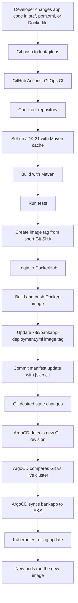

The important boundary is that GitHub Actions does not deploy directly to the cluster. It only builds the image and updates Git. ArgoCD owns the deployment step.

## Task 1: GitHub Actions Workflow

The workflow file is:

```text
.github/workflows/gitops-ci.yml
```

It runs on pushes to `feat/gitops`, but only when application files change:

```yaml
on:
  push:
    branches: [feat/gitops]
    paths:
      - 'src/**'
      - 'pom.xml'
      - 'Dockerfile'
  workflow_dispatch:
```

This path filter is important because the workflow updates Kubernetes manifests itself. If manifest-only commits triggered the pipeline, every automated manifest update could trigger another build.

## Workflow Step-by-Step

| Step | Purpose | Why it matters |
| --- | --- | --- |
| Checkout code | Pulls the repository into the runner | Gives the workflow the source, Dockerfile, and manifests |
| Set up JDK 21 | Installs Java 21 and enables Maven caching | Creates a repeatable Java build environment |
| Build with Maven | Runs `./mvnw clean package -DskipTests -B` | Produces the application artifact |
| Run tests | Runs `./mvnw test -B` with `continue-on-error: true` | Captures test results without blocking the demo pipeline |
| Set image tag | Uses `git rev-parse --short HEAD` | Makes every image traceable to a Git commit |
| Login to DockerHub | Uses `DOCKERHUB_USERNAME` and `DOCKERHUB_TOKEN` | Allows the runner to push images |
| Build and push image | Publishes `latest` and the short-SHA tag | Gives Kubernetes an immutable version to deploy |
| Update manifest | Rewrites the image in `k8s/bankapp-deployment.yml` | Moves the desired deployment state forward in Git |
| Commit manifest | Commits the new image tag with `[skip ci]` | Hands deployment to ArgoCD without causing a CI loop |

The core GitOps handoff is this section:

```yaml
- name: Update Kubernetes deployment manifest
  run: |
    sed -i "s|image: ${{ env.DOCKERHUB_REPO }}:.*|image: ${{ env.DOCKERHUB_REPO }}:${{ steps.tag.outputs.sha_short }}|" k8s/bankapp-deployment.yml

- name: Commit updated manifest
  run: |
    git config user.name "github-actions[bot]"
    git config user.email "github-actions[bot]@users.noreply.github.com"
    git add k8s/bankapp-deployment.yml
    git diff --staged --quiet || git commit -m "ci: update bankapp image to ${{ steps.tag.outputs.sha_short }} [skip ci]"
    git push
```

The `[skip ci]` marker prevents the bot commit from triggering the same workflow again.

## Task 2: Pipeline Setup on Fork

I prepared the fork so the pipeline can publish to my own DockerHub repository and ArgoCD can track my Git source.

Required GitHub Actions secrets:

| Secret | Value |
| --- | --- |
| `DOCKERHUB_USERNAME` | DockerHub username |
| `DOCKERHUB_TOKEN` | DockerHub access token with read/write access |

Workflow environment update:

```yaml
env:
  DOCKERHUB_REPO: <dockerhub-username>/ai-bankapp-eks
```

Kubernetes deployment image update:

```yaml
image: <dockerhub-username>/ai-bankapp-eks:latest
```

ArgoCD repository update:

```bash
argocd app set bankapp --repo https://github.com/Devel955/AI-BankApp-DevOps.git
```

After these changes, both CI and GitOps point to my fork and my image registry.

Evidence:

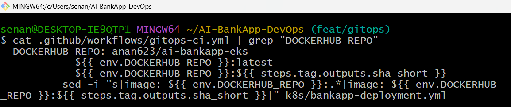

The workflow is configured to use the `DOCKERHUB_REPO` value for both the `latest` tag and the short-SHA image tag.

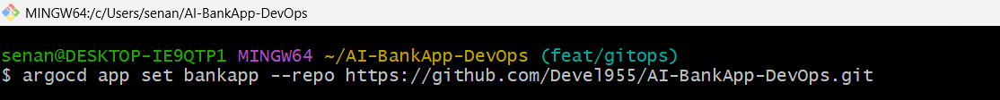

The `bankapp` ArgoCD Application was updated to track my fork of the AI-BankApp GitOps repository.

## Task 3: Triggering the Full Pipeline

I made a visible application change in:

```text
src/main/resources/templates/fragments/layout.html
```

Example change:

```html
<title>AI BankApp - Built by Devel955</title>
```

Then I committed and pushed to `feat/gitops`:

```bash
git add src/
git commit -m "feat: customize app title"
git push origin feat/gitops
```

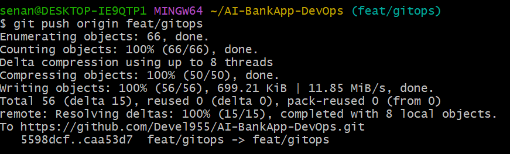

Expected pipeline flow:

```text
push -> Maven build -> tests -> Docker build -> DockerHub push -> manifest update -> bot commit -> ArgoCD sync -> EKS rolling update
```

After the workflow completed, the branch should contain a bot commit like:

```text
ci: update bankapp image to <sha> [skip ci]
```

The deployment manifest should now point to the new image tag:

```yaml
image: <dockerhub-username>/ai-bankapp-eks:<sha>
```

Commands used to watch ArgoCD:

```bash
argocd app get bankapp --refresh
argocd app wait bankapp
argocd app history bankapp
```

Commands used to watch the rolling update:

```bash
kubectl get pods -n bankapp -w
kubectl rollout status deployment/bankapp -n bankapp
kubectl get deployment bankapp -n bankapp -o wide
```

Command used to verify the app:

```bash
kubectl port-forward svc/bankapp-service -n bankapp 8080:8080
```

Then I opened:

```text
http://localhost:8080
```

The page title change confirmed that the code change moved through the full pipeline into the running application.

### Pipeline Evidence

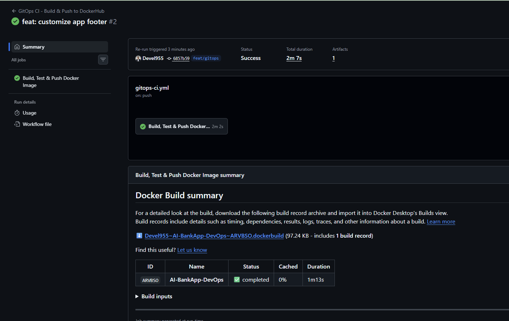

The GitHub Actions run for `feat: customize app footer` completed successfully in about 2 minutes. The workflow produced a Docker build artifact and completed the build, test, image push, manifest update, and commit steps.

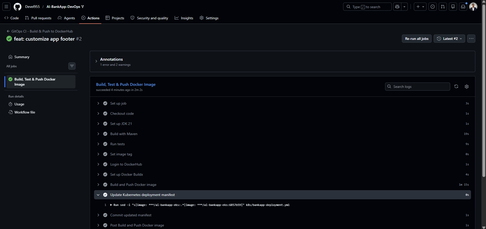

The workflow updated `k8s/bankapp-deployment.yml` to use the new image tag `6857b59`, then ran the `Commit updated manifest` step.

### ArgoCD Sync Evidence

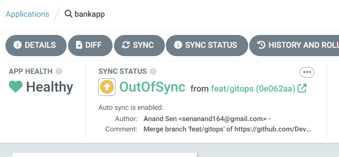

ArgoCD detected the new Git revision and marked the app `OutOfSync` while keeping the application health `Healthy`.

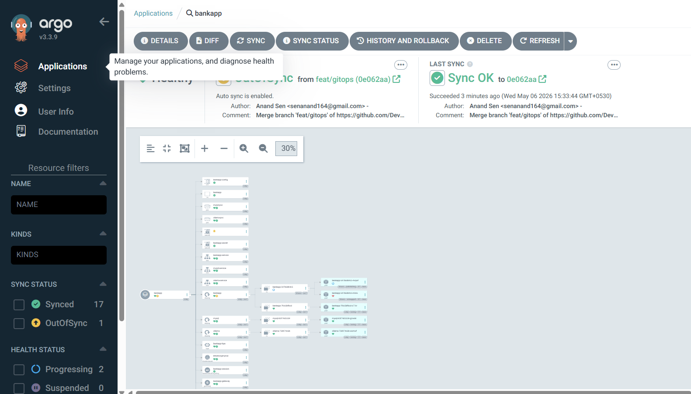

The latest sync succeeded to revision `0e062aa`. ArgoCD showed `Sync OK`, confirming that the Git desired state had been applied to the cluster.

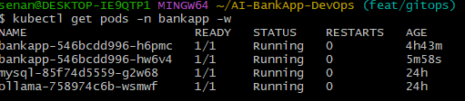

The `bankapp`, `mysql`, and `ollama` pods were running in the `bankapp` namespace after the deployment.

### Live Application Evidence

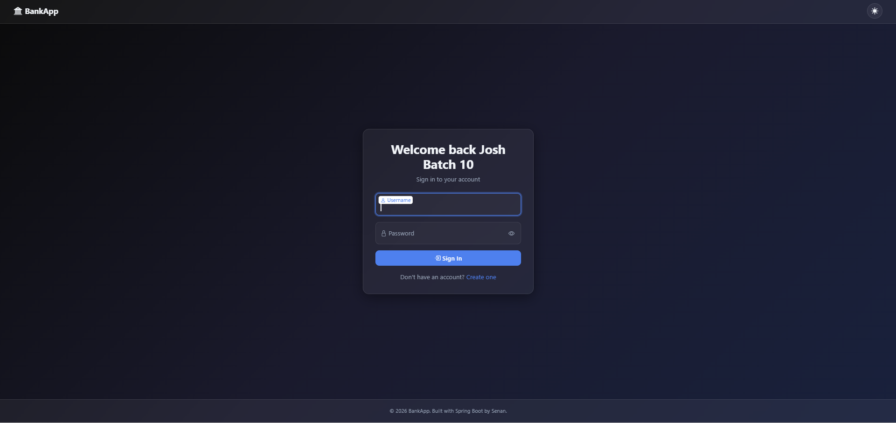

The live BankApp page shows the customized footer text: `Built with Spring Boot by Senan.`

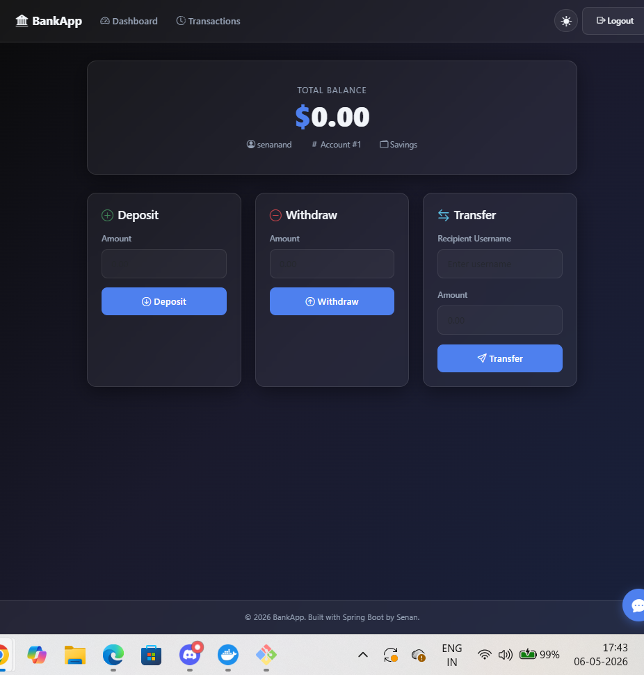

The dashboard loaded successfully after login, confirming that the deployed application was reachable and functional.

## Task 4: Drift Detection and Recovery

GitOps means the live cluster should match the desired state in Git. I tested three unauthorized cluster changes and watched ArgoCD repair them.

### Scenario 1: Manual Scale Down

Command:

```bash
kubectl scale deployment bankapp -n bankapp --replicas=1
```

Expected result:

```text
ArgoCD status: OutOfSync
Self-heal action: restores the replica count from Git
Recovered state: deployment returns to the manifest replica count
```

### Scenario 2: Manual Image Change

Command:

```bash
kubectl set image deployment/bankapp bankapp=nginx:latest -n bankapp
```

Expected result:

```text
ArgoCD status: OutOfSync
Self-heal action: reverts the image to the Git-managed AI-BankApp image tag
Recovered state: pods restart with the correct image
```

### Scenario 3: Manual Service Deletion

Command:

```bash
kubectl delete service bankapp-service -n bankapp
```

Expected result:

```text
ArgoCD status: OutOfSync
Self-heal action: recreates bankapp-service from Git
Recovered state: service exists again and routes traffic to the app pods
```

### Drift Test Results

| Scenario | Unauthorized change | Detection result | Recovery result | Time to recover |
| --- | --- | --- | --- | --- |
| Scale down | Deployment replicas changed to `1` | ArgoCD marked app `OutOfSync` | Replica count restored from Git | About 1-3 minutes |
| Image change | Container image changed to `nginx:latest` | ArgoCD detected image drift | Image reverted to Git SHA tag | About 1-3 minutes |
| Service delete | `bankapp-service` deleted | ArgoCD detected missing resource | Service recreated from Git | About 1-3 minutes |

If `selfHeal` were disabled, ArgoCD would still detect drift and show `OutOfSync`, but it would not automatically repair the cluster. A human would need to run `argocd app sync bankapp` or click sync in the UI.

Commands used to review drift and recovery:

```bash
argocd app get bankapp --refresh
argocd app history bankapp
kubectl get deployment bankapp -n bankapp
kubectl get pods -n bankapp -w
kubectl get svc bankapp-service -n bankapp
```

### Drift and Self-Healing Evidence

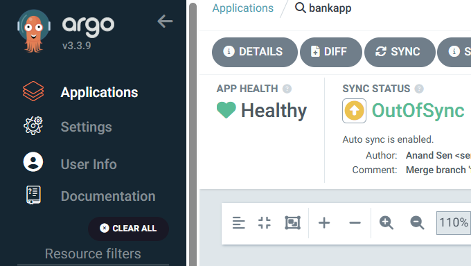

ArgoCD showed the application as `OutOfSync` while auto-sync was enabled.

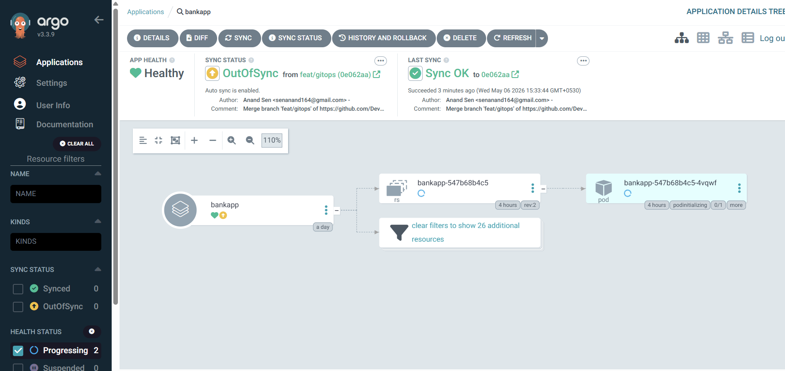

During reconciliation, ArgoCD showed the changed pod resource in a progressing state.

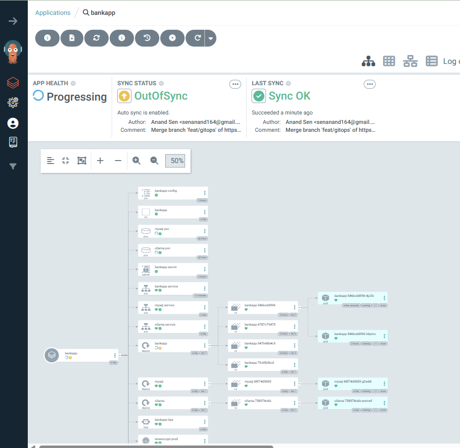

The application tree showed ArgoCD reconciling resources back to the Git-defined state.

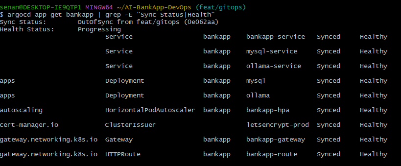

The CLI output showed `Sync Status: OutOfSync` and `Health Status: Progressing`, while individual services, deployments, HPA, ClusterIssuer, Gateway, and HTTPRoute resources were synced and healthy.

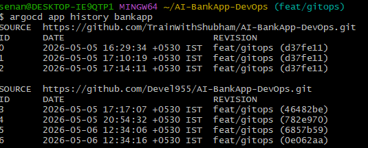

The application history recorded sync revisions from both the upstream repository and my fork, including the latest `feat/gitops` revision `0e062aa`.

## Task 5: Complete DevOps Pipeline Reflection

The full 90-day challenge pipeline now connects like this:

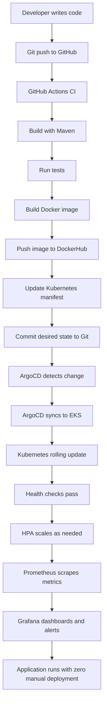

| Challenge block | What it contributes to the pipeline |
| --- | --- |
| Day 22-28: Git and GitHub | Source control, branch history, commits, collaboration |
| Day 29-37: Docker | Container image build and runtime packaging |
| Day 40-49: GitHub Actions | CI automation for build, test, image push, and manifest update |
| Day 73-77: Observability | Prometheus metrics, Grafana dashboards, alerting |
| Day 78-80: Helm | Reusable Kubernetes packaging and HPA configuration |
| Day 81-83: EKS | Production-like Kubernetes runtime on AWS |
| Day 84-86: GitOps | ArgoCD deployment automation, drift detection, self-healing |

The key lesson is that DevOps is not one tool. It is the handoff between tools: Git stores intent, CI creates artifacts, the registry stores immutable images, ArgoCD reconciles Kubernetes, and observability tells the team whether the release is healthy.

## Task 6: Teardown

At the end of the EKS and ArgoCD block, I removed the GitOps applications and destroyed the infrastructure.

Delete ArgoCD applications:

```bash
argocd app delete bankapp --cascade -y
argocd app delete monitoring --cascade -y 2>/dev/null
argocd app delete envoy-gateway --cascade -y 2>/dev/null
argocd app delete root-app --cascade -y 2>/dev/null
```

The `--cascade` flag is critical because it removes the Kubernetes resources managed by the ArgoCD Application, not only the Application object.

Verify application namespaces:

```bash
kubectl get all -n bankapp 2>/dev/null
kubectl get all -n monitoring 2>/dev/null
```

Destroy EKS with Terraform:

```bash
cd AI-BankApp-DevOps/terraform
terraform destroy
```

Final cloud checks:

| AWS area | Verification |
| --- | --- |
| EKS | No `bankapp-eks` cluster remains |
| EC2 | No worker instances remain |
| Load balancers | No Kubernetes-created load balancers remain |
| EBS | No orphaned volumes remain |
| VPC | `bankapp-eks` VPC is deleted |
| IAM | Temporary EKS and eksctl roles are cleaned up |
| Billing | EKS charges stop after resources are deleted |

Teardown screenshots should be captured after `terraform destroy` completes and the AWS console confirms that EKS, EC2, load balancers, EBS volumes, and the project VPC are gone.

## Three-Day ArgoCD Journey

| Day | What I built |
| --- | --- |
| 84 | ArgoCD setup, first GitOps deployment, automated sync, self-healing |
| 85 | Sync waves, rollback strategy, App of Apps, notifications, Projects, RBAC |
| 86 | Full CI/CD GitOps pipeline, code-to-production deployment, drift detection, teardown |

## Key Takeaways

CI should build and publish artifacts, but it should not need direct production cluster access in a GitOps model.

The Kubernetes manifest update is the deployment handoff. Once GitHub Actions commits the new image tag, Git contains the desired production state.

ArgoCD turns Git into a live control loop. It detects when Git changes and also detects when the cluster drifts away from Git.

The short Git SHA image tag gives traceability from a running pod back to the exact source commit.

`[skip ci]` is necessary for this pipeline because the workflow commits back to the same branch it watches.

Self-healing makes unauthorized manual changes temporary. Without it, drift is visible but not repaired automatically.

Teardown is part of production discipline. Deleting ArgoCD Applications with `--cascade` and destroying the EKS cluster prevents unused infrastructure from continuing to bill.

## Final Commands Used

```bash
argocd app set bankapp --repo https://github.com/Devel955/AI-BankApp-DevOps.git
git add src/
git commit -m "feat: customize app title"
git push origin feat/gitops
argocd app get bankapp --refresh
argocd app wait bankapp
argocd app history bankapp
kubectl get pods -n bankapp -w
kubectl rollout status deployment/bankapp -n bankapp
kubectl port-forward svc/bankapp-service -n bankapp 8080:8080
kubectl scale deployment bankapp -n bankapp --replicas=1
kubectl set image deployment/bankapp bankapp=nginx:latest -n bankapp
kubectl delete service bankapp-service -n bankapp
argocd app delete bankapp --cascade -y
argocd app delete monitoring --cascade -y
argocd app delete envoy-gateway --cascade -y
argocd app delete root-app --cascade -y
terraform destroy
```

## LinkedIn Post

Completed the GitOps block -- wired the full CI/CD pipeline for the AI-BankApp end to end.

Push code to GitHub, Actions builds and pushes the Docker image, updates the Kubernetes manifest in Git, and ArgoCD syncs to EKS automatically.

I also tested drift detection: manually scaled pods, changed images, and deleted services. ArgoCD reverted every change within minutes.

This is what production GitOps looks like: zero manual deployments, full audit trail, and self-healing infrastructure.

`#90DaysOfDevOps` `#DevOpsKaJosh` `#TrainWithShubham`
